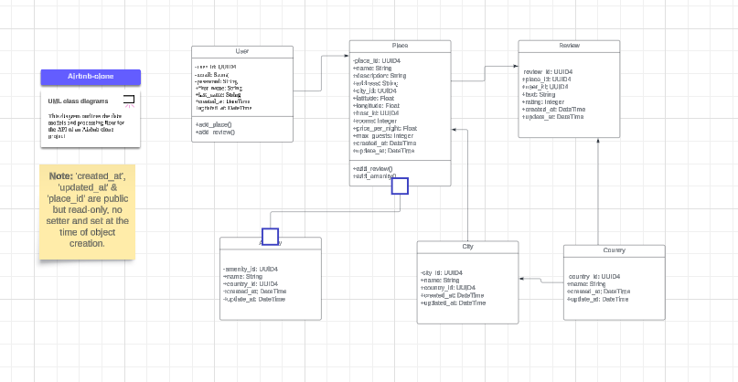

# Simple Airbnb Clone in Flask

This Flask application serves as a simple clone of Airbnb, providing a RESTful API for managing users, places, amenities, reviews, cities, and countries. It is built using Python and Flask, utilizing blueprints to organize routes and JSON files for data storage. The application offers a scalable architecture and is planned for future integration with a backend database.

## Author of this project:
### **Xavier J. Cruz Santiago**

Feel free to contact me for any questions or feedback regarding this project.

## Table of Contents

- [Features](#features)
- [Local Setup](#local-setup)
- [UML Diagram Overview](#uml-diagram-overview)
- [Project Architecture](#project-architecture)
- [Usage of the API](#usage-of-the-api)
- [Future Plans](#future-plans)
- [Resources](#resources)

- [UML Diagram Overview](#uml-diagram-overview)


## Features

- **User Management**: Create, update, delete, and retrieve user profiles.
- **Place Management**: Allows the addition, modification, deletion, and retrieval of place details.
- **Review Management**: Support for adding, updating, and deleting reviews, as well as fetching reviews for specific users or places.
- **Amenity Management**: Manage amenities that can be associated with places.
- **City Management**: Manage city details, allowing for the addition, update, and deletion of city information.
- **Country Retrieval**: Retrieve details of countries, supporting broader geographic functionalities.


## Local Setup

### To set up the project locally, follow these steps:

1. **Clone the repository:**
```bash
   git clone https://github.com/Xavier308/airbnb_clone.git
```
```bash
   cd your-repository-name
```
## Set up a virtual environment:


```bash
python -m venv venv

source venv/bin/activate  # On Windows use `venv\Scripts\activate`
```
### Install dependencies:

```bash
pip install -r requirements.txt
```
### Initialize the application:

```bash
python run.py
```
## UML Diagram Overview
The project began with designing a Unified Modeling Language (UML) diagram to plan and visualize the system's structure before coding.


[UML Diagram - Lucid tool](https://lucid.app/lucidchart/e0cd139e-e4e6-4c89-bd0b-d89784df1658/edit?viewport_loc=-2703%2C-1089%2C4631%2C2037%2C0_0&invitationId=inv_cb4e75ab-f7ac-4577-9e9d-7f15f4b32b38)

## Project Architecture
This project utilizes a layered (n-tier) architecture to separate responsibilities, which simplifies management, maintenance, and scalability.

### Directory Structure Overview:
```bash
Airbnb-Clone
├── app
│   ├── api
│   │   ├── amenity_api.py
│   │   ├── country_city_api.py
│   │   ├── place_api.py
│   │   ├── review_api.py
│   │   └── user_api.py
│   ├── models
│   │   ├── amenity.py
│   │   ├── base_model.py
│   │   ├── city.py
│   │   ├── country.py
│   │   ├── place.py
│   │   ├── review.py
│   │   └── user.py
│   ├── persistence
│   │   └── data_manager.py
│   └── services
│       ├── amenity_service.py
│       ├── country_city_service.py
│       ├── place_service.py
│       ├── review_service.py
│       └── user_service.py
├── assets
├── instance
│   ├── config.py
│   └── json_data
│       ├── amenities.json
│       ├── cities.json
│       ├── countries.json
│       ├── places.json
│       ├── reviews.json
│       └── users.json
├── README.md
├── requirements.txt
├── run.py
└── tests
```
### How to Print the Directory Tree in the Terminal

Install the tree Dependency:
To use the tree command, first ensure that it is installed on your system by running:
```bash
pip install tree
```
### Print the Tree:
This command filters out certain directories and prints a tree view up to 3 levels deep:
```bash
tree -L 3 -I "__pycache__|myenv|__init__.py"
```
## Usage of the API
For instructions on how to use the API, please refer to the API_DOCUMENTATION.md file.
[API Documentation](airbnb_clone/API_DOCUMENTATION.md)

## Future Plans
- **Database Integration:** Integration with a SQL or NoSQL database to enhance data storage capabilities.
- **API Expansion:** Expansion of the API to include more complex functionalities, accommodating a wider range of user interactions.
- **Security Enhancements:** Enhancement of security features, including the implementation of OAuth, to ensure robust security.
- **Front-End Development:** Development of a front-end using HTML, CSS, and JavaScript to provide a user-friendly interface that connects seamlessly with the app.

## Resources

- [Concept Page: OOP - Introduction to UML](https://intranet.hbtn.io/concepts/1166)
- [UML Class Diagram Tutorial](https://www.lucidchart.com/pages/uml-class-diagram)
- [Python Documentation](https://docs.python.org/3/)
- [Unit Testing in Python](https://docs.pytest.org/en/8.2.x/)
- [PyTest testing tool](https://docs.python.org/3/library/unittest.html)
- [ISO 3166-1](https://www.iso.org/iso-3166-country-codes.html)
- [Docker Official Documentation](https://docs.docker.com/)
- [Gunicorn Configuration](https://docs.gunicorn.org/en/stable/configure.html)
- [Alpine Linux Documentation](https://wiki.alpinelinux.org/wiki/Main_Page)
- [Docker Volumes](https://docs.docker.com/storage/)
- [Dockerfile Best Practices](https://docs.docker.com/build/building/best-practices/)
